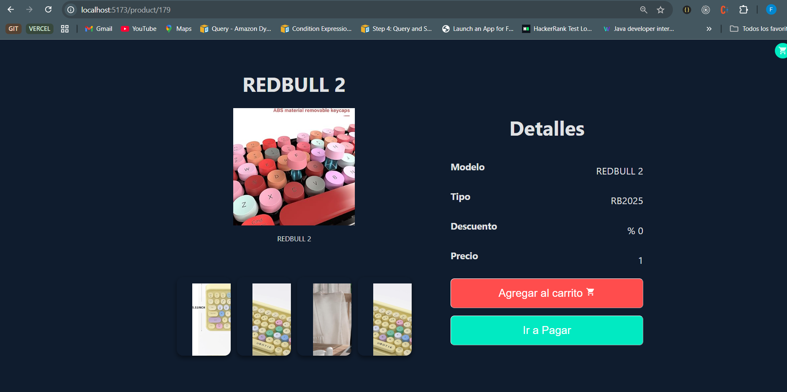

# Prueba React Fernando

## Instalación

- Levanta el backend y cambia en el archivo `.env.ts` la dirección del backend.
- Instalación inicial:

```js
npm i
```

- Correr el programa:

```js
npm run dev
```

- Se ejecutará en: http://localhost:5173/

## Funcionamiento

- Haz clic en Comprar
  

- Selecciona la categoría ALL
  

- Debido a que en el JSON inicial no estaban definidos los valores de precio, se estableció un valor de 50 para los productos en el grid, y se utilizó una imagen de referencia para todos los productos. Esto se debe a que el JSON de prueba no incluía un campo de imágenes.
  

- Haz clic en el ícono del carrito para agregar productos. En el carrito, las imágenes pueden ser diferentes por la misma razón: el JSON no especifica un campo de imagen.
  
- Al agregar un producto, aparece una notificación en la parte inferior.

  

- El ícono del basurero elimina todos los elementos del carrito. Todos los productos tienen un precio de 1 dólar al no estar especificado en el JSON.

- Al hacer clic en la imagen de un producto, se redirige a una pantalla con más información.

  

- En esta pantalla se muestran imágenes aleatorias debido a la falta de información en el JSON.
  
- Al hacer clic en el botón Ir a pagar, se redirige a la pantalla de detalles del carrito.
  
- Al hacer clic en el botón PAY, la información se guarda en el log que puede visualizarse en el siguiente directorio del backend, en formato JSON:

```
D:\...\...\storeback\WebApiStore\WebApiStore\DataBase
```


